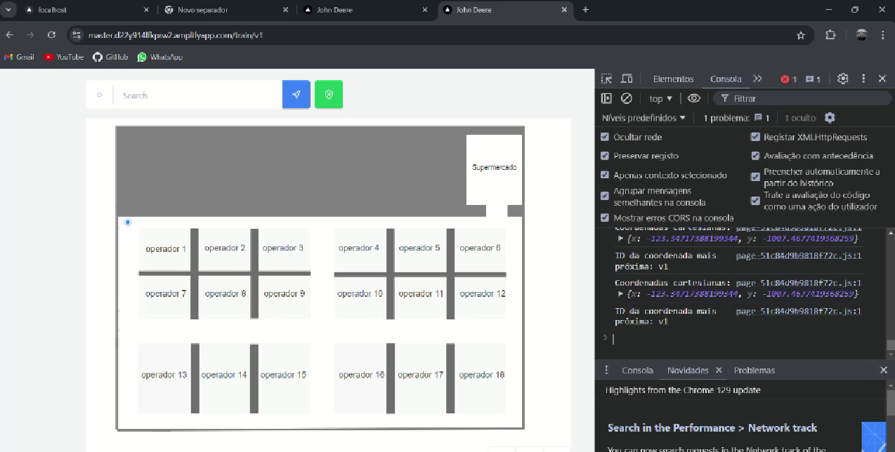

<h1>Challenge HackInLoc</h1>

<h2>Introdução</h2>

  Considerando que o objetivo principal da empresa John Deere era otimizar as operações da empresa, desenvolvemos uma tecnologia que, por meio de conexão Wi-Fi, capta informações dos roteadores próximos à localização dos carrinhos. Essas informações são enviadas à API de geolocalização do Google, que fornece a localização exata dos carrinhos.
Para solucionar o problema relacionado ao excesso de material nos carrinhos do kit, instalamos um botão que os funcionários utilizarão para informar quando o carrinho estiver vazio, possibilitando, assim, a atualização da sua localização.

<h2>Desenvolvimento</h2>

  O projeto foi feito utilizando principalmente a biblioteca chamada "WifiLocation" no esp32 com a linguagem C++. O esp32 se conecta ao Wi-Fi, e depois escaneia todos os roteadores na região e pegando informações como RSSI(Indicador de Força de Sinal Recebido), MacAddress e o canal, e assim enviando esses dados para a API geolocation utilizando a biblioteca 'WifiLocation', que irá retornar a latitude e longitude do esp32, e depois esses dados são enviados para o site, que foi feito no framework Next, via protocolo HTTP. O site estará hospedado em um servidor na nuvem, assim podendo visualizar as informações pelo site, para teste utilizamos o replit. Os resultados esperados para essa arquitetura é: informações precisas da geolocalização, tranferência de dados bem-sucedidas, atualizações em tempo real e instabilidade da conexão Wi-Fi.

<h2>Resultados</h2>

  O ESP32, utilizando a biblioteca WifiLocation, obtém com sucesso a latitude e longitude através da API de geolocation. A precisão dos resultados pode variar dependendo da densidade de roteadores Wi-Fi disponíveis na região, assim como da força do sinal. Ele consegue enviar as informações de roteadores (RSSI, MacAddress e canal) para a API via HTTP e, após obter a geolocalização, envia os dados de latitude e longitude para o site hospedado na nuvem (via protocolo HTTP). Devido à natureza de redes Wi-Fi, o ESP32 pode experimentar instabilidades ao tentar se conectar a redes em diferentes regiões. A flutuação no RSSI pode impactar a velocidade de resposta ou a precisão da localização.

  O site (feito no framework Next) reflete imediatamente as atualizações enviadas pelo ESP32. Toda vez que o ESP32 obtém novas coordenadas ou há mudanças na força do sinal, essas atualizações são exibidas em tempo real no dashboard do site.

<h2>Demonstração do projeto</h2>

 O link a seguir é um vídeo sobre o projeto junto de uma demonstração dele: <a href="https://www.youtube.com/watch?v=r1p44xEGkqE">https://www.youtube.com/watch?v=r1p44xEGkqE</a> 
 

